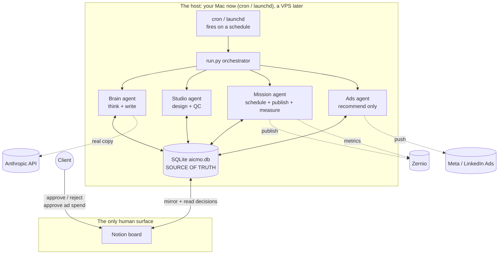
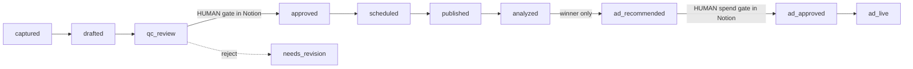

# AI CMO, the whole product

This is the single source of truth for how the AI CMO works as a product, not how
the hackathon team split the build. It is transcribed from the architecture map
across its six sections, with the runtime model, the build status of every
component, and the owner of each.

If you want the day-of build split (three cards, who touches which folder), that
lives in [`ASSIGNMENTS.md`](ASSIGNMENTS.md) and [`TEAM-BRIEF.md`](TEAM-BRIEF.md).
For the named-tool audit (which external service each station reads and its real
status in code), see [`docs/qa/reference-architecture.md`](docs/qa/reference-architecture.md).

---

## 1. The product in one sentence

A content marketing department that runs as software. One seed idea goes in, and
the system thinks, writes, designs, quality-checks, waits for one human decision,
then publishes, measures, and recommends paid promotion on the winners.

It runs unattended. The client never opens a terminal and never opens Claude
Code. Claude Code is a build tool, not part of the product. The client's entire
experience is a Notion board.

---

## 2. The runtime model

This is the part the per-station docs leave out, and it is what makes the product
real instead of a demo script.

The agents run as code on a host, on a schedule. Today that host is your own
machine using `cron` or macOS `launchd`, so there is nothing to pay for and the
whole build can be tested end to end including Notion. Later the exact same code
and the exact same cron jobs move to a VPS (Hostinger, Ubuntu) so it stays on when
your laptop sleeps. The host is the only thing that changes. Behavior is identical.

Read it as three layers:

- **The host** runs the agents on a schedule. No human, no Claude Code. SQLite
  (`aicmo.db`) is the source of truth every agent reads and writes.
- **Notion** is the only human surface. The agents mirror the pipeline to it, and
  the client acts on it.
- **External services** (Anthropic for generation, Zernio for publish and
  analytics, Meta and LinkedIn for ads) are called by the agents on the host. Each
  is credential-gated and falls back to a deterministic stub when its key is
  absent, so the loop always runs.

---

## 3. The agents (the four stations)

| Station | Folder | Reads to writes | What it does | Automated or human |
|---|---|---|---|---|
| 1. Brain | `engine/brain/` | `captured` to `drafted` | Turns a seed idea into an on-brand draft via the Brick chain (Intake, Topic, Angle, Hook, Story), grounded in the client's 6-layer context. | Automated |
| 2. Studio | `engine/studio/` | `drafted` to `qc_review` or `needs_revision` | Renders the post to a 1080x1350 graphic and scores it against the brand spec with vision QC. | Automated |
| 3. Mission | `engine/mission/` | `qc_review` to `approved` to `scheduled` to `published` to `analyzed` | The human approval gate (surfaced in Notion), then schedule, publish, and pull analytics. | Human gate, then automated |
| 4. Ads | `engine/ads/` | `analyzed` to `ad_recommended` to `ad_approved` to `ad_live` | Recommends paid promotion on winners only, behind a human spend gate. Built from all three stations: Brain writes ad copy, Studio renders ad creative, Mission wires the push. | Human spend gate, then automated |

---

## 4. The pipeline

One post is one database row walking through statuses. Six transitions run
themselves. Two are human decisions, and both happen in Notion.

Off-ramps: `needs_revision` (back to Brain or Studio with a note) and `rejected`
(dead end), both set at a human gate or by QC.

---

## 5. The full component map

Status legend: **BUILT** real and working in this repo today. **PARTIAL** partly
present. **STUB** a deterministic placeholder that returns canned data. **NOT
BUILT** absent from this repo (named in the architecture only).

Owner is the hackathon card responsible (see `ASSIGNMENTS.md`). **UNASSIGNED**
means no card covers it, which is exactly where the prototype gaps live.

A "ref: complete" note means a reference implementation exists in the sibling repo
`aicmo-complete`.

### 5.0 Runtime and deployment (the layer that makes it a product)

| Component | Status | Owner | Note |
|---|---|---|---|
| Autonomous orchestration on a schedule (cron / launchd fires the loop, no human) | NOT BUILT | UNASSIGNED | `run.py` runs the loop once when a human invokes it. Nothing fires it on a schedule. This is the core prototype gap. |
| Brain generation as Python (Anthropic SDK on the host, unattended) | NOT BUILT | UNASSIGNED (Card 1 built the offline stand-in) | `ASSIGNMENTS.md` Card 1 says "use Claude (Anthropic SDK)"; today real generation lives in the `/ai-cmo-generate` Claude Code command, not in Python. An unattended product cannot call a Claude Code command. ref: complete (`engine/brain/generate.py`). |
| Notion as the live surface, written + decisions read back | REAL (read-back built; only the scheduled trigger is missing) | Mission Control / dashboard layer | `engine/dashboard/notion_provision.py` creates a real child page + Content Pipeline DB + Metrics DB; `notion_sync.py` pushes posts and `pull_gate` reads the client's approve/reject decision back into the loop; `notion_layout.py` lays out dashboard tiles. Credential-gated (`NOTION_TOKEN`, `NOTION_PARENT_PAGE_ID`), offline fallback writes `outputs/<client>-board.json` + `data/notion_state.json`. What is missing is firing the sync on a schedule (folds into the cron row above). Board/calendar views remain a manual Notion-UI step. |
| Host setup: local cron / launchd jobs (prototype), then VPS lift | NOT BUILT | UNASSIGNED | No job definitions exist yet. The launchd pattern is well established in Shannon's workspace and lifts cleanly to an Ubuntu VPS later. |

### 5.1 Overview, multi-repo architecture

| Component | Status | Owner | Note |
|---|---|---|---|
| `aicmo-core` (public engine, this repo) | BUILT | Mission Control (integration captain) | De-cliented engine, frozen `db.py` contract, human gate. |
| Client VPS (Hostinger, Ubuntu) | NOT BUILT | UNASSIGNED | Optional later host. The local cron path replaces it for the prototype. |
| `{client}-data/` private 6-layer context | PARTIAL | Brain | `client-data/lumen-skin/` exists as the demo. `brands.json` not present. |
| `{client}-context-ref` raw source store | NOT BUILT | UNASSIGNED | Private raw-source store (brand decks, audits), never deployed. |
| `sync_aicmo_core.py` + nightly git pull | NOT BUILT | UNASSIGNED | Sync seam from engine to host. |

### 5.2 Onboarding, 6-layer context, migration

| Component | Status | Owner | Note |
|---|---|---|---|
| 6-layer context: Positioning, Brand & Audience, Strategy, Offers & Funnels, Voice, Guardrails | BUILT | Brain | Present per client in `client-data/`. The Brain reads all six. |
| `visual-brand.md` + `brand.css` | PARTIAL | Studio | Present for lumen-skin. |
| Output: commit + mirror each layer to Notion | NOT BUILT | UNASSIGNED | |
| Client VPS hardening runbook (sudo, SSH key, deploy key, ufw, fail2ban) | NOT BUILT | UNASSIGNED | Only needed at the VPS-lift stage. |
| Migration playbook (snapshot, clone, preflight, Notion DB, cutover, grace) | NOT BUILT | UNASSIGNED | Per-client migration. |

### 5.3 Content engine, Brick chain

| Component | Status | Owner | Note |
|---|---|---|---|
| `/capture` (stub idea into the DB) | PARTIAL | Brain | Exists via `engine/save_draft.py` and the loop seed. |
| Brick chain (Intake, Topic + pillar, Angle, Hook, Story/Shift) | BUILT (offline) | Brain | The Brain logic. Lives in `.claude/skills/content-os` + `engine/brain/`. Real model generation is the gap in 5.0. |
| Staged `/develop` back half (two STOP gates) | NOT BUILT | UNASSIGNED | Core has `/ai-cmo-generate` only. |
| Voice / pattern libraries (strategy, voice, angle, hook, story) | PARTIAL | Brain | Present as skills. |
| `seo_guardrails.py` (8 checks, banned list, 10-pt) | NOT BUILT | UNASSIGNED | |
| `/schedule` (cadence gaps, interactive) | NOT BUILT | UNASSIGNED | |
| Persona agents (Strategist, Architect, Copywriter, Creative, Ads) | NOT BUILT | UNASSIGNED | Named in the map only. |

### 5.4 Render and QC

| Component | Status | Owner | Note |
|---|---|---|---|
| Render input: `visual-brand.md` + `brand.css` + `templates/social/*.html.j2` | PARTIAL | Studio | Template present; render does not consume it yet. |
| `render.py` (Playwright, 1080x1350 @2x) | STUB | Studio | Sets the path, produces no file. ref: complete |
| `brand_qc.py` (Claude vision, pass/borderline/fail, gate at 85) | STUB | Studio | Hardcodes a passing score. ref: complete |
| Output: PNG + Notion image | NOT BUILT | UNASSIGNED | |
| Render routing (claude_html default, gemini optional, placid deferred) | NOT BUILT | UNASSIGNED | ref: complete has Placid + Gemini + Playwright backends. |

### 5.5 Orchestrator and distribution

| Component | Status | Owner | Note |
|---|---|---|---|
| State machine (`run.py` walks captured to ad_live) | BUILT | Mission Control | `db.py` is the frozen contract. |
| Hard rule: no script ever promotes to `approved`; a QC pass is not approval | BUILT | Mission Control | Enforced by the human gate. |
| Off-ramps (`needs_revision`, `rejected`, plus `compliance_review`, `publish_error`) | PARTIAL | Mission Control | First two exist; the clinical and error states are not modeled. |
| Zernio single publish layer | STUB | Mission Control | `publish.py` writes a fake URL. ref: complete (`engine/mission/zernio.py`) |
| Distribution schedules (per-channel cadence, lookahead) | NOT BUILT | UNASSIGNED | `schedule.py` is basic. |
| `collect_zernio_analytics.py` | STUB | Mission Control | `analytics.py` returns mock metrics. |
| `engagement_sync.py` (to Notion) | NOT BUILT | UNASSIGNED | ref: complete (`engine/mission/engagement_sync.py`) |

### 5.6 Analytics, SEO, GEO, client dashboard

Most of this section is absent, with one real exception: the Notion client
dashboard layer (see 5.0). The analytics, SEO, GEO, reporting, and metrics modules
are not built.

| Component | Status | Owner | Note |
|---|---|---|---|
| External sources: GA4, Search Console, DataForSEO, AIO engines, Stripe | NOT BUILT | UNASSIGNED | ref: complete has DataForSEO + AEO/AIO. |
| DataOS `collect.py` (daily cron) + `generate_metrics.py` | NOT BUILT | UNASSIGNED | ref: complete has `intelligence` + `aeo`. |
| Reporting crons (weekly brief, portfolio digest, weekly report) | NOT BUILT | UNASSIGNED | ref: complete has `dashboard/report.py` + `metrics.py`. |
| Client dashboard (scaffold page, metrics tiles) | PARTIAL | Mission Control / dashboard layer | `notion_provision.py` + `notion_layout.py` scaffold a real Notion dashboard page and tiles; `kpi_menu.py` holds the KPI menu config but its values are mock until real metrics are wired. The Data Jumbo embed stays manual. |
| Reporting + metrics modules (`metrics.py`, `report.py`) | NOT BUILT | UNASSIGNED | Weekly brief and computed pipeline metrics. ref: complete. |

---

## 6. The gaps that block a working prototype

A "working prototype" means the whole loop runs unattended on local cron, with
real generation, and a human approving in a real Notion board. Against that bar,
these are the blockers, all currently UNASSIGNED:

1. **Autonomous orchestration** (5.0). A cron/launchd job that fires the loop on a
   schedule with no human. Without it there is no product, only a script someone
   runs by hand.
2. **Brain generation as Python** (5.0). Move real copy generation out of the
   Claude Code command and into a Python Anthropic call on the host, so the
   unattended loop can actually write. ref: complete.
3. **Studio is a stub** (5.4). `render.py` writes no image file and `brand_qc.py`
   returns a hardcoded passing score, so the graphic and its quality gate are not
   real. ref: complete.

Reading client decisions back from Notion is already built in core
(`notion_sync.pull_gate`); what remains on the Notion side is firing the sync on a
schedule, which folds into gap 1. The feedback loop, the human gate, the
orchestrator, and the ads rationale are real.

Everything else (real render, real QC, real Zernio, real ads push, the whole
analytics section) upgrades the loop but is not required for a first unattended
end-to-end run. Each has a reference implementation in `aicmo-complete`.

---

## 7. How core and complete relate

- **`aicmo-core`** is the public engine and the team scaffold. Every station ships
  as a deterministic offline stub so the loop runs end to end with no keys, and
  each builder replaces their stub with the real, credential-gated integration.
- **`aicmo-complete`** is the fuller reference implementation. The parts marked
  "ref: complete" above already exist there and can be ported.

Both repos reconcile to this document. When a component moves status, update its
row here and re-run the source-reconciliation auditor (`docs/qa/README.md`).
