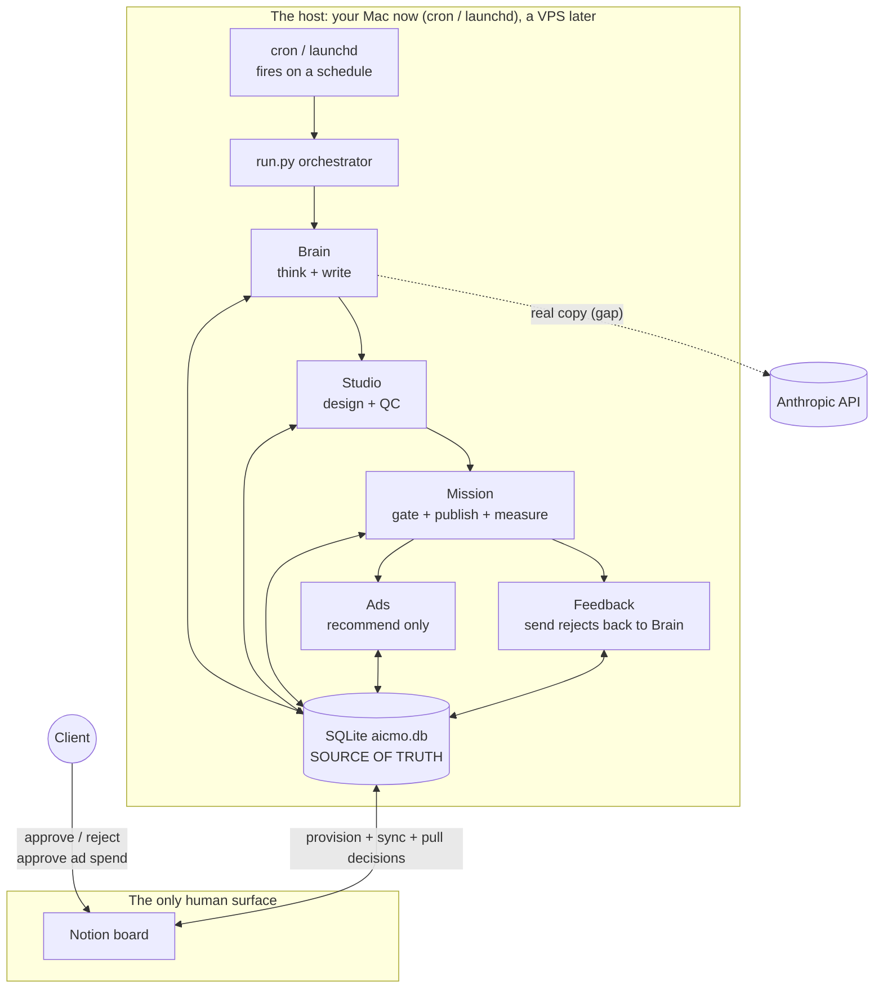

# aicmo-core

**The AI CMO.** A content marketing department that runs as software. For how the
whole product works (the runtime model, the full component map, and the open
gaps), see [`ARCHITECTURE.md`](ARCHITECTURE.md).

One content idea ("a post") is a single database row that walks through a status
pipeline. Each station reads the row at one status, does its job, and advances it
to the next: it ideates, designs, gets human sign-off, publishes, measures, and
recommends paid promotion on the winners.

The whole loop runs OFFLINE on the Python standard library with no API keys. Every
external service has a stub or deterministic stand-in that runs by default and
only calls the real service when the matching env var is set. So a fresh clone
walks a seed idea from `captured` all the way to `ad_live` with one command and no
setup.

This repo is the engine. It went deep on the **Notion human surface**: the
dashboard layer provisions a real Notion board and reads the client's approve and
reject decisions back into the loop. The sibling repo `aicmo-complete` went deep
on the **station integrations** (render backends, publishing, ads push,
intelligence). Both share the same two open gaps: the Brain does not yet generate
copy as autonomous Python, and nothing runs on a schedule. See
[`ARCHITECTURE.md`](ARCHITECTURE.md) for the full status of every component.

## Who this is for (ICP)
A small business with a marketing team of one, or a founder who can't afford a
marketing team at all. The AI CMO runs the content department for them: ideates,
designs, gets human sign-off, publishes, measures, and recommends paid promotion
on the winners.

Demo client: **Lumen Skin Studio**, a small-batch skincare brand
(`client-data/lumen-skin/`).

## The contract-first rule
`db.py` is the **frozen contract**. It defines the `posts` table, the `Status`
constants, and the helper functions every station uses. Changing it requires all
builders to agree. A schema change breaks everyone at once. Everything else (the
station internals) is yours to rewrite freely.

## The runtime model

This is what makes it a product, not a script. The agents run as code on a host,
on a schedule. Today that host is your own machine using `cron` or macOS
`launchd`, so there is nothing to pay for and the whole build can be tested end to
end including Notion. Later the exact same code and cron jobs move to a VPS
(Ubuntu) so it stays on when your laptop sleeps. The host is the only thing that
changes. The client never opens a terminal or Claude Code. Their whole world is
the Notion board.



Read it as three layers: the **host** runs the agents on a schedule (no human, no
Claude Code), **SQLite** is the source of truth, and **Notion** is the only human
surface. Today the loop is driven by hand (`run.py`) rather than by cron, and the
Brain's real generation runs through a Claude Code command rather than autonomous
Python. Those two are the open gaps.

## The status pipeline

```
captured                          (a seed idea lands)
   |  brain.generate
drafted                           (pillar, angle, hook, body written)
   |  studio.render               (image_path set)
   |  studio.brand_qc
qc_review                         (passed visual QC, awaiting human)
   |  mission.gate  [HUMAN: Flask board or Notion]
approved        (or rejected / needs_revision off-ramp)
   |  mission.schedule
scheduled
   |  mission.publish
published
   |  mission.analytics
analyzed                          (metrics in)
   |  ads.ads_agent               (only if it's a winner)
ad_recommended
   |  [HUMAN spend gate]
ad_approved
   |  ads.ads_agent
ad_live
```

Off-ramps: `needs_revision` and `rejected` (set at the human gate or by QC). A
rejection is captured as a `human_note` and fed back to the Brain by `feedback.py`.

## The 4 stations (who owns what)

| Station | Folder | Reads -> Writes | Owner |
|---|---|---|---|
| 1. Brain | `engine/brain/` | `captured` -> `drafted` (Intake, Topic, Angle, Hook, Story brick chain) | Builder A |
| 2. Studio | `engine/studio/` | `drafted` -> image -> `qc_review` / `needs_revision` (render + vision QC at 85) | Builder B |
| 3. Mission | `engine/mission/` | `qc_review` -> `approved` -> `scheduled` -> `published` -> `analyzed` (human gate + publish + analytics) | Builder C |
| 4. Ads | `engine/ads/` | `analyzed` -> `ad_recommended` -> `ad_approved` -> `ad_live` (recommend-only, human spend gate) | Builder C |

The one human decision lives between render and publish: `mission.gate`.

## How to run the loop

No installs needed. Standard library only.

```bash
python3 run.py "why your competitors all sound the same"
```

This creates a post, walks it through every station, prints each status
transition, and prints the final row as JSON. The post ends at `ad_live` if it is
a winner, or `analyzed` if its engagement does not clear the promote threshold.

The published URL is a stand-in; real publishing needs `ZERNIO_API_KEY` (not yet
wired). The Notion board provisions for real behind `NOTION_TOKEN` plus
`NOTION_PARENT_PAGE_ID`, and falls back to `outputs/<client>-board.json` plus
`data/notion_state.json` offline. The ad rationale calls Anthropic when
`ANTHROPIC_API_KEY` is set, with a template fallback. The human gate and the ad
spend gate auto-approve in `run.py` (via `auto_approve=True`) so the loop completes
unattended; in production a person taps Approve in Notion (or the Flask board).

## The commands (Claude Code skills + commands)

The craft lives in skills, the Brain runs through a command. `/ai-cmo-generate` is
a Claude Code command, not a shell command. It is how the Brain produces real,
model-written copy. Without Claude Code, the loop still runs end to end with
`python3 run.py "<seed>"` using the offline Brain stand-in.

| Command | Walks | Skills loaded |
|---|---|---|
| `/ai-cmo-generate "<seed>"` | `captured` -> `drafted` | content-os, positioning-angles, writing-style, hook-library, story-structures |

Core ships this one command today. Complete ships the full set (intel, render,
publish, engagement-sync, ads, report, onboard).

## Beyond the core loop (full architecture)

The four-station loop is the spine. The full product adds the layers below. This
table is core's honest status, verified against the code. "ref: complete" means a
working reference implementation lives in `aicmo-complete`.

| Area | Module(s) | Status in core | Note |
|---|---|---|---|
| Notion human surface | `engine/dashboard/notion_client.py`, `notion_provision.py`, `notion_schema.py`, `notion_sync.py`, `notion_layout.py` | REAL | Live Notion API (stdlib urllib). Provisions a child page + Content Pipeline DB + Metrics DB, lays out dashboard tiles, syncs posts, and pulls the client's gate decision back into the loop. Offline fallback writes `outputs/<client>-board.json` + `data/notion_state.json`. Board/calendar views remain a manual Notion-UI step. |
| Feedback loop | `engine/feedback.py` | REAL | A rejected post is sent back to the Brain with the human note (`db.advance` to `captured`); `reprocess_to_review` re-runs brain, render, QC. Learning persists as the `human_note` on the row, consumed by the Brain. |
| Ads (recommend-only) | `engine/ads/ads_agent.py` | REAL rationale, stub push | Real winner score + budget logic, real Anthropic rationale (`claude-sonnet-4-6`, gated on `ANTHROPIC_API_KEY`, template fallback). The campaign push returns a fake campaign id (Meta/LinkedIn API is the stretch). |
| Render backends | `engine/studio/render.py` | STUB | Sets `renders/<id>.png` but writes no file. Real Playwright/Pillow/Placid/Gemini render is `ref: complete`. |
| Vision QC | `engine/studio/brand_qc.py` | STUB | Returns a hardcoded `qc_score = 90` and notes "vision QC not run." Real vision scoring is `ref: complete`. |
| Intelligence (front of funnel) | `engine/intelligence/` | NOT BUILT | Seed ideas from SEO/GEO/competitor signals. `ref: complete`. |
| AEO (AI visibility) | `engine/aeo/` | NOT BUILT | Is the brand cited in AI answers. `ref: complete`. |
| Integrations | `engine/integrations/` | NOT BUILT | DataForSEO, Placid, Gemini, GSC, Apify, Backblaze clients. `voc.py` has a DataForSEO injection seam but no client module. `ref: complete`. |
| Reporting + metrics | `engine/dashboard/metrics.py`, `report.py` | NOT BUILT | Weekly brief + pipeline metrics. `kpi_menu.py` has the menu config with mock values. `ref: complete`. |
| Leak guard (IP boundary) | `engine/leak_guard.py` | NOT BUILT | Scans a client box for any other client's name. `ref: complete`. |

## The open gaps (what blocks a working prototype)

A working prototype means the whole loop runs unattended on local cron, with real
generation, and a human approving in a real Notion board. Against that bar:

1. **Brain generation is not autonomous.** `engine/brain/generate.py` is a
   deterministic offline stand-in; real copy comes from the `/ai-cmo-generate`
   Claude Code command. An unattended host cannot call a Claude Code command, so
   this needs a Python Anthropic call. `ref: complete` (same gap there).
2. **Nothing runs on a schedule.** `run.py` walks the loop when a human invokes
   it. There is no cron or launchd job firing it unattended.
3. **Studio is still a stub.** Render writes no file and QC returns a hardcoded
   pass, so the image and its quality gate are not real yet. `ref: complete`.

The Notion read-back, the feedback loop, the human gate, the orchestrator, and the
ads rationale are real. The gaps are generation, scheduling, and Studio.

## QA

This system is checked against its source materials, not just against itself. The
QA approach, the auditor charter, and the audit trail live in
[`docs/qa/README.md`](docs/qa/README.md). The named-tool audit (which service each
station reads and its real status) is in
[`docs/qa/reference-architecture.md`](docs/qa/reference-architecture.md). The
principle: a QA pass that audits the code against an incomplete spec still ships an
incomplete system, so the spec itself gets audited against the source.

## Card 3 — Mission Control

- `engine/mission/gate.py` — the human board (two gates): content Approve/Revise/Reject and ad spend Approve/Decline. Run: `.venv/bin/python engine/mission/gate.py` then http://localhost:5050
- `engine/mission/driver.py` — `drive(post_id)` runs schedule, publish, analytics, ads after approval; shared by the board and `run.py`.
- `engine/mission/{schedule,publish,analytics}.py` — demo-safe deterministic stand-ins (no API keys).
- `engine/ads/ads_agent.py` — winner score + Anthropic rationale (template fallback) + stub ad pusher behind the spend gate.

Tests: `.venv/bin/python -m pytest tests/mission/ -v`

## Layout

```
ARCHITECTURE.md  # the whole product: runtime, full component map, open gaps
db.py            # FROZEN CONTRACT (schema + helpers)
run.py           # orchestrator, walks one idea through every station
client-data/     # 6-layer context per client (lumen-skin demo)
templates/       # social post template (Station 2 renders this)
engine/          # the 4 stations + the Notion dashboard layer + feedback
.claude/skills/  # the craft: content-os, positioning-angles, writing-style, hook-library, story-structures
.claude/commands/ # the Brain: ai-cmo-generate
docs/            # qa/ (audit), notion-setup.md, superpowers/ (plans + specs)
data/            # aicmo.db + notion_state.json created here (gitignored)
outputs/         # <client>-board.json stub board (gitignored)
```
